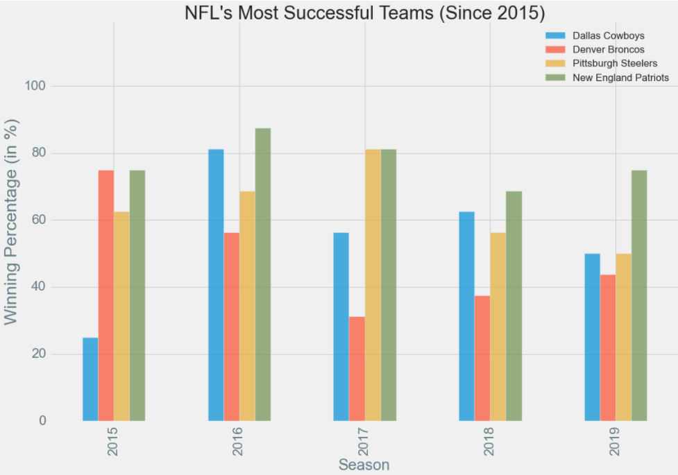

# NFL_Teams_Recent_Performance
This is to visualize the recent winning percentages of top teams of NFL
This was my assignment for the 
#### Applied_Plotting_Charting_and_Data_Representation_in_Python_course_of_Coursera.
My Hypotheis Question was 
##### 'What is the winning percentage of the all-time most successful teams in the National Football League (NFL) according to sportsshows.net (link : https://sportsshow.net/most-successful-american-football-teams/) in the past 5 years (from 2015-2019) ?'

This bar graph shows the winning percentages of the NFL's most successful teams in the recent years. It shows that teams like New England Patriots are maintaining a high winning percentage in the past 5 years, whereas team like Denver Broncos has a decline in their winning percentages in the recent years. This visualization shows that New England Patriot has been a strong team compared to any other teams in the recent years

